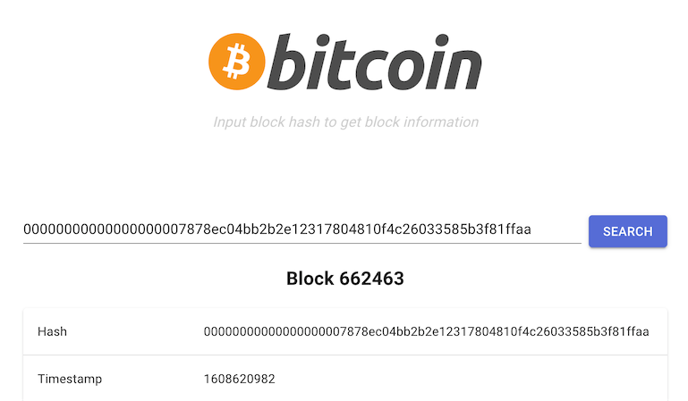

# Blockchain Query Blocklet Demo

This project is an demo [blocklet](https://www.arcblock.io/en/blocklets) for viewing BTC blockchain information by block hash.

## Development & Deployment

In the project directory, you can run:

### `yarn start`

Runs the app in the development mode.\
Open [http://localhost:3000](http://localhost:3000) to view it in the browser.

Also a graphql server [http://localhost:3030/graphql](http://localhost:3030/graphql) for backend.

### `yarn bundle`

Build blocklet bundle

### `blocklet deploy .blocklet/bundle`

Deploy blocklet to abtnode

## Tech Specs

* Server
  * [express.js](http://expressjs.com/) for api server
  * [graphql.js](https://graphql.org/graphql-js/) for graphql server
  * [@abtnode/nedb](https://www.npmjs.com/package/@abtnode/nedb) for blockchain data caching
  * [blockchain api](https://www.blockchain.com/api/blockchain_api) `https://blockchain.info/rawblock/$block_hash`
* Client
  * [Apollo](https://www.apollographql.com/) graphql client for data fetching & state management
  * [Material-UI](https://material-ui.com/) for UI components
  * [react-virtual](https://github.com/tannerlinsley/react-virtual) for quick rendering large amount of transactions

## License

The code is licensed under the MIT license found in the
[LICENSE](LICENSE) file.
